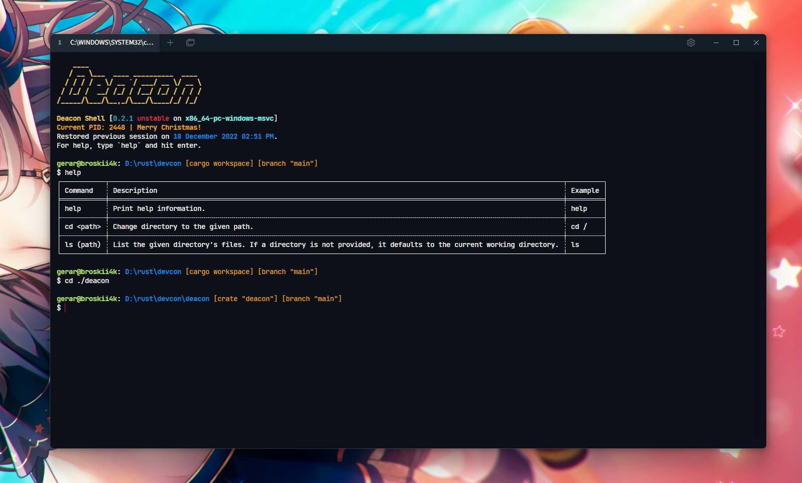

<div style="text-align: center;"><h1>Deacon</h1></div>
<div style="text-align: center;">Shell 0.2.1</div>
<br>
<div style="text-align: center;"></div>

## About

Deacon is a cross-platform shell that aims to replace `cmd.exe` and PowerShell for Windows users, and to
be on par with mature shells like `bash`.

## Building Deacon

Currently, Deacon is still in development. If you still want to use Deacon, clone this repository
and build it using `cargo +nightly build`.
This requires Rust `1.68.0`.

## Functions
> **NOTICE** The following is not fully implemented yet!

To define a function, one only needs to write the function signature and its body.
For example,

```
func x() {
    echo "Hello, world!"
    echo "Hallo Welt!"
}
```

You must end with a newline before the ending `}`. In other words,

```
func x() { 
    echo "Hello, world!" 
    echo "Hallo Welt!" }
```

will produce an error, and

```
func x() { 
    echo "Hello, world!"
}
```

will not.