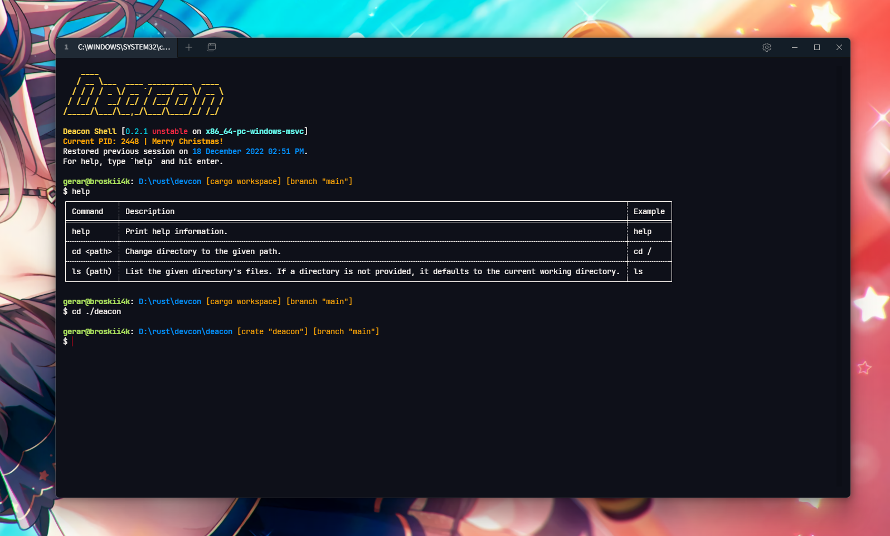

<h1>Deacon</h1>

Shell 0.2.1

 

## About
Deacon is a cross-platform shell that aims to replace `cmd.exe` and PowerShell for Windows users, and to
be on par with mature shells like `bash`.

## Building Deacon
Currently, Deacon is still in development. If you still want to use Deacon, clone this repository
and build it using `cargo +nightly build`.
This requires Rust `1.68.0`.