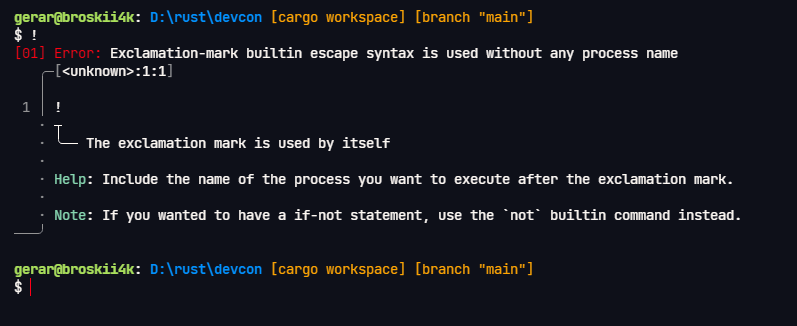

# Error Index

## `00` Parsing Error

This indicates a parsing error. Refer to the error message for details on how to resolve the error.

## `01` EMBES used alone

The exclamation-mark is used to escape the process name, in the sense that
if there is a builtin command and an executable which are both named `foo`,
entering `foo` will call the former and entering `!foo` (EMBES - exclamation-mark builtin escape syntax)
will instead call the latter.

Using EMBES by itself with no process name is illegal.